#### Getting started NKS

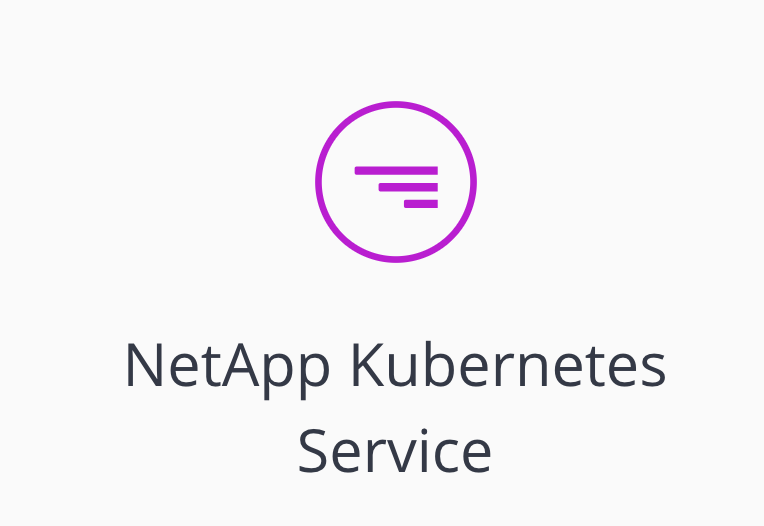

NetApp Kubernetes Service (NKS)の使い所を見ながら、ポイントとなる機能をみていくシリーズです。

第１回目は基本編として簡単な使い方から存在する機能を見ていきたいと思います。   
 これから何回続くかは不明ですが現時点では以下のコンテンツも考えています。

*   自作Helm Chartを登録する
*   Heptio Arkを使ってバックアップ・リストア
*   Federationを試す！

#### What is NetApp Kubernetes Service (NKS)

一言で説明すると、各種クラウドプロバイダーに Kubernetesをデプロし、デプロイ後の管理までをしてくれる **SaaS** です。

バックエンドでは通常のVM(AWSであればEC2)をデプロイし、kubernetesをインストールする方法と、各種クラウドプロバイダーが提供しているk8s serviceをデプロイします。

それだけではなく、事前にHelmチャートを指定しておけばデプロイ時に自動でインストールしてくれます。

その他にもマネージドでバックアップを取得することやクラスタのフェデレーションといったことをクリックだけで実現できます。

今回は基本的なオペレーションを見ていきます。

#### サービスポータル

以下のURLからNKSを使える。

*   [https://cloud.netapp.com](https://cloud.netapp.com)

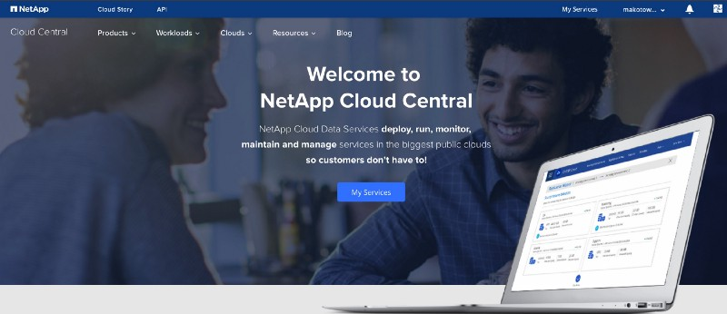

クラウドセントラル、サービスのダッシュボード

サインアップして、サービス一覧へ。

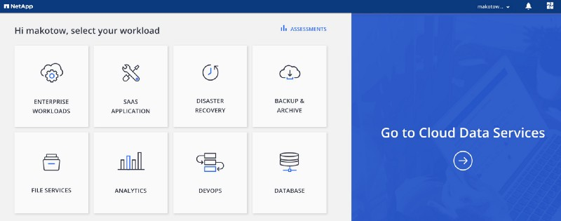

ユースケース一覧、右の矢印をクリック

「Go to Cloud Data Services」をクリックして

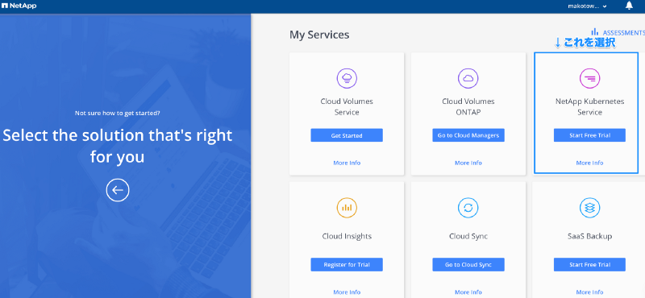

サービス一覧

#### 基本オペレーション

約３クリックでkubernetesクラスをある程度のHelm chart入りでデプロイができます。

#### 各種アカウント登録

もちろんデプロイをするには各種クラウドプロバイダのクレデンシャル登録が必要になります。

最初になにも登録していないと登録を促す画面がでるので適宜登録します。

#### デプロイメントの流れ

#### サービス選択

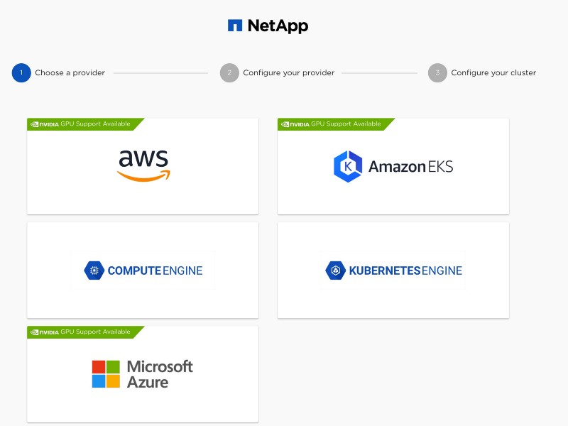

デプロイするプロバイダーを選択

ここではAWSを選択します。  
 その後、以下の画面に遷移して、デプロイするマスターノードの数、ワーカーノードの数、ディスクサイズやデプロイするVPCを選択する画面になります。

10/25時点でGPUサービスが追加されていました。

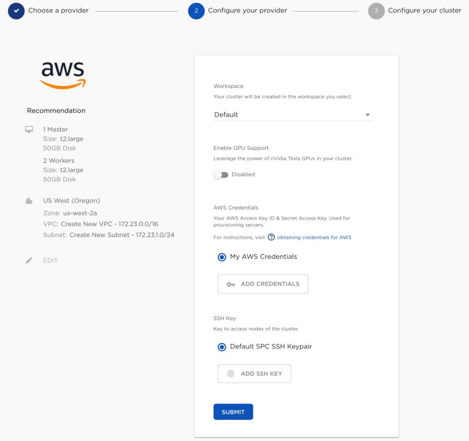

リソースの設定をする画面

デプロイ先などを選んだら画面したの「Submit」で次の画面へ。

#### 必要な要素を選択(Solutions)

ここまで来るとデプロイまでもうすぐです。  
 ここではクラスタ名、デプロイするk8sのバージョン、RBACやダッシュボードをインストールするか、Pod/Service ネットワークのIP指定。

デプロイするk8sを形成するOSなどを選択します。

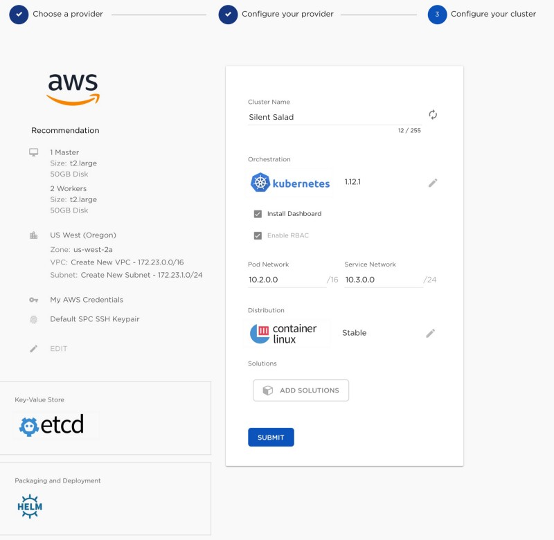

ソフトウェアの導入・バーションの設定

「ADD SOLUTIONS」というボタンをクリックすると、  
 デプロイ時に導入するアプリケーションを選択できます。

３つ種類があって事前に導入する予定のHelmChartを選択できます。

*   NetApp Container Engine Solution
*   Trusted Chart
*   My Charts

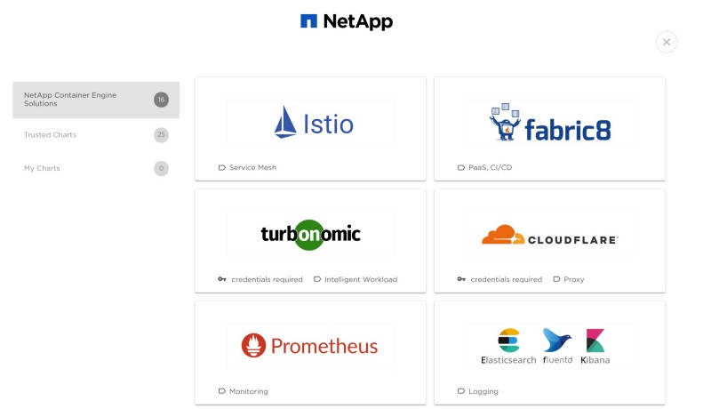

登録されているHelmチャート一覧

デプロイした時点で Prometheusが稼働していたり、Istioが稼働しているといったものが作れます。

また、 My Chartについては自分たちで準備しているHelm repositoryを登録することができます。

ちなみに Prometheus を追加すると、依存関係のあるHAPROXYも自動で追加してくれます。

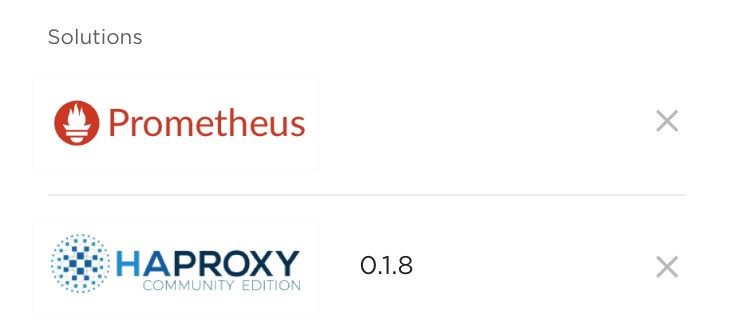

依存関係も見てくれる。

これで画面下の「Submit」をクリックするとデプロイが始まります。  
 デプロイが完了するとユーザ作成時に登録したメールアドレスにクラスタ作成完了のメールが届きます。

出来上がったクラスタは一覧でみることができます。

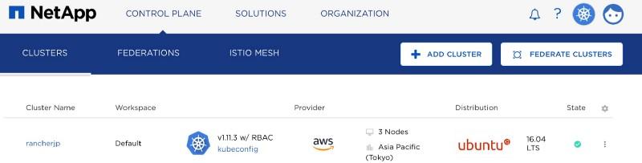

クラスタ一覧

#### デプロイ後のクラスタに対する操作

出来上がったクラスタのクラスタ名をクリックするとクラスタの詳細をみることができます。

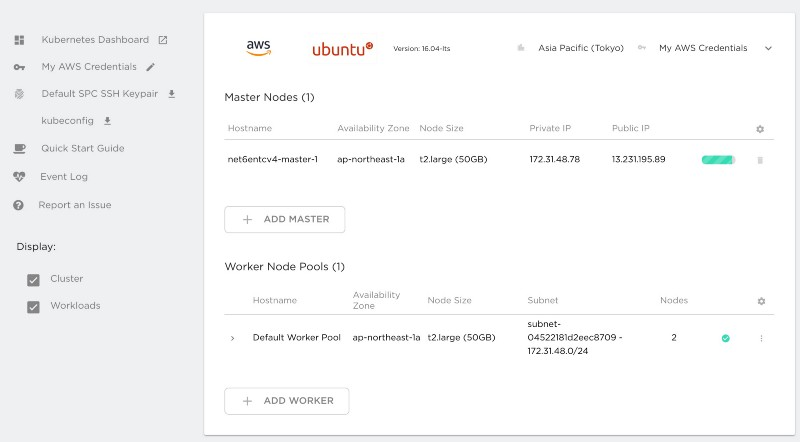

クラスタの構成

この画面からマスターノードの追加、ワーカーノードの追加、Solutionsの追加ができます。

その他にも現在稼働中のDeploymentを確認することができます。

構成情報のバックアップにも対応しており、同一画面で Heptio Ark の有効化、設定を行うことができます。

直感的になにをするかわかりますが、一応説明すると、Heptio 自体がk8sの構成情報をバックアップしてくれます。

この画面では以下のような入力項目を入れると定期的にk8sのバックアップ情報を取得してくれます。

*   バックアップしたデータをどこに保存するか？
*   どのリージョンに保存するか？
*   頻度はどのくらいか？
*   使うクレデンシャルは？

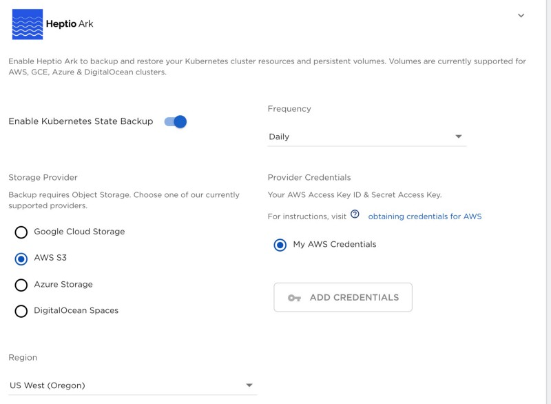

heptio Arkの設定

リストアもこの画面から実施することができます。

リストアボタンをクリックすると現状取得しているバックアップの一覧がでてきてここから戻すことができます。

#### まとめ

今回はNKS自体の説明と具体的なデプロイまでのオペレーション、デプロイ後になにができるかを書いてみました。

これからは上記の画面に出てきている 「Federation」、「Istio Mesh」や「Heptio Ark」を使ってみた系をやってみたいと思います。
