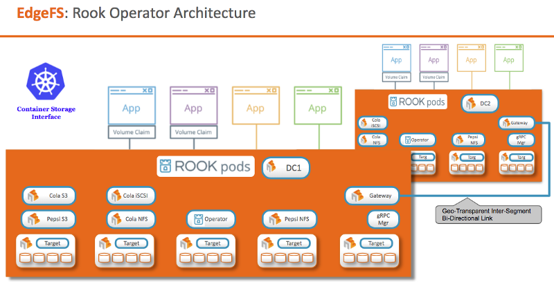

 Rookだらけの Advent Calendar 2019/12/16:はじめの一歩
 
この記事は「[Rookだらけの Advent Calendar](https://qiita.com/advent-calendar/2019/rook)」 2019/12/16分です。Rook EdgeFSについて記事を投稿します。

コンテンツとしては以下の7本を予定しています。

1. 2019/12/16: EdgeFS 概要
2. 2019/12/17: EdgeFS クラスタデプロイ
3. 2019/12/18: EdgeFS NFSサービス
4. 2019/12/19: EdgeFS iSCSIサービス
5. 2019/12/22: EdgeFS S3/S3X
6. 2019/12/23: EdgeFS CSI
7. 2019/12/24: EdgeFS ISGW Link

本日は１回目「EdgeFS 概要」です。現時点はRook1.1.8がStableですがmasterブランチを使って試していきます。この記事は本家の記事を読み解いてき基本的には本家のニュアンスをそのままにし、わかりにくい箇所には補足を入れています。1日目は概念や考え方、何ができるかを説明するためほとんどが文章となります。

**TL；DR**を読んでいただき、興味がわけば気になるところを読んでいただき、技術的にどうやるかを知りたい方は2日目からを読んでいただければと思います

## TL;DR

*   全部入りストレージのようなもの(S3, NFS, iSCSI, NoSQL)の接続を提供
*   地理的に分散しているストレージサイトを１つのデータサービスとして仮想的にアクセス可能、マルチクラウドやハイブリッドクラウド、エッジIoTを実現するもの
*   master ブランチではEdgeFS DataFabricという名前になっている

<!--more-->

<!-- toc -->

---

## EdgeFS Status

まずはじめにEdgeFSとRookの現状について確認します。

Rook のストレージプロバイダーとしてEdgeFSは、Stableという状態です。

)](1.png)

## EdgeFS とは？

本家のドキュメントの最初の一文がよく表しているものだと思います。
> EdgeFS is high-performance and fault-tolerant decentralized data fabric with virtualized access to S3 object, NFS file, NoSQL and iSCSI block.

ハイパフォーマンス、耐障害性を備え分散したデータにS3、NFS、NoSQL、iSCSI といった接続方法で仮想的にアクセスできるようになるものです。

EdgeFSは、Kubernetes上で実行される1つのグローバルネームスペースとして相互に接続された地理的に分散したサイトを拡張することができ、Kubernetes上のステートフルアプリケーションに耐障害性のある高性能永続ボリュームを提供します 。

EdgeFSノードは各サイトのKubernetesノードにコンテナ（StatefulSet）としてデプロイされ、利用可能なストレージ容量をプールし、同じノードで実行されるクラウドネイティブアプリケーションへS3 / NFS / iSCSI などのストレージプロトコルを介してデータを提供します。

## EdgeFSの特徴

### High performance

標準的なストレージプロトコル（NFS,iSCSI,S3）で高いスループット、低レイテンシをステートフルアプリケーションに提供します。

さまざまなユースケースのパフォーマンス特性に対応：デバイスがHDDのみ、SSD / HDDハイブリッド、SSD / NVMeのみのようなパフォーマンス特性が違うものも扱えます。

### Geo-Scalable

EdgeFSは、1つのグローバルネームスペースとして接続された、地理的に分散した無制限のサイトにまたがっています。 ローカルサイト内のオブジェクト、ブロック、またはファイルアクセスに対して同様に適切にスケーリングし、リモートサイトのデータへの効率的なアクセスを可能にします。

### Kubernetes integrated

どのクラウドのKubernetes上にもEdgeFSをデプロイすることができます。CSI、Rookオーケストレーションにより、管理の容易性、制限のないファイル、オブジェクト、バケットまたはディレクトリ単位の粒度のスナップショットを提供します。

## どのような動作か

すべての変更が完全にバージョン管理され、グローバルで不変です。「git」に精通している場合、そのコアでの動作は似たものとなります。  
グローバルスコープでのコピーオンライト技術と考えると理解が進みます。

本家の一文にもある通り、より理解をすすめるために説明を追加します。

*   EdgeFS はオブジェクトストレージにGitのパラダイムを拡張し、エミュレートされた ストレージプロトコルを介してKubernetesのPVとしてアクセス可能とするものです。
*   ストレージプロトコルにはオブジェクト（S3/S3X）、ファイル（NFS）、ブロック（iSCSI）が使えます。
*   完全にバージョン管理された変更、完全に不変のメタデータおよびデータにより、ユーザーデータを透過的に複製、分散し、多くのジオサイト間で動的にプリフェッチできます。

## EdgeFSのデザイン

ここではRookとの関係を確認していきます。

本家を参照したアーキテクチャを最初に示しました。
Rookを使用すると、Kubernetesの機能を使いEdgeFS サイトを簡単に展開できます。  
RookがKubernetesで実行されている場合、Pod または外部アプリケーションは、Rookが管理するブロックデバイスとファイルシステムをマウントしたり、オブジェクトストレージにS3 / S3X APIでアクセスできます。

### Rook EdgeFS Operatorがやること

*   ストレージコンポーネントの構成を自動化し、クラスターを監視して、ストレージが使用可能で正常な状態を保つようにします。
*   ストレージクラスタのブートストラップと監視に必要なすべてを備えたシンプルなコンテナです。StatefulSet storage Targets, gRPC Manager、およびPrometheus Multi-Tenantダッシュボードを開始および監視します。接続されたすべてのデバイス（またはディレクトリ）は、プールされたストレージサイトを提供します。ストレージサイトは、1つのグローバルネームスペースデータファブリックとして簡単に相互接続できます。
*   PodやEdgeFSのサービスの実行に必要なアーティファクトを初期化することにより、Targets、Scale-out NFS、オブジェクトストア（S3 / S3X）、iSCSIボリュームのCRDを管理します。
*   storage Targetsを監視して、クラスターが正常であることを確認します。 EdgeFSは、サービスのフェールオーバー、およびクラスターのスケールアウト、スケールインに応じて行われる可能性のあるその他の調整を動的に処理します。
*   緊密に統合されたCSIプラグインも付属しています。CSI PodはすべてのKubernetesノードにデプロイされます。ネットワークストレージデバイスの接続、NFSマウント、dynamic provisioning など、ノードが必要なすべてのストレージ操作が処理されます。

### EdgeFSの機能

機能面では以下のような特徴を持っています。

一部分繰り返しになりますが網羅すると以下の通りです。

*   File, Block, Objecのプロトコルを提供
*   速く、簡単にデプロイ
*   データ保護
*   データ削減
*   暗号化
*   QoSのマルチテナントへの適応
*   SPOFがない
*   Highly-Available

### File, Block and Objectを提供

さまざまなストレージプロトコルを地域分散したネームスペースで提供します。対応しているプロトコルはS3, S3X(Range Writes, Snapshot, など),NFS,iSCSIのプロトコルです。

### Fast &amp; easy deployment

RookとCSIとの連携をしています。それにより、さまざまな環境下でデプロイが数分で完了します。

### Data protection

データはレプリカをとり、オフラインイレイジャエンコードします。セルフヒーリングとスナップショットで耐障害性を実現します。

### Data Reduction

地理を考慮した重複排除、オンライン圧縮があります。クロスサイトのネットワーク使用率を低減したり、リモートデータへのアクセススピードをアップさせます。

### At rest encryption

オブジェクト、バケット、LUN、ファイルをサーバサイドにてソフトウェアの強力な暗号化をしています。

すべてのデータとメタデータは普遍でSHA-3 256-bit か 512bit で暗号化されています 。

### Multi-Tenancy with QoS controls

地理を考慮したマルチテナントをファイル、LUN、オブエジェクトで細かい粒度でQoSを設定可能です。

### No SPoF

すべてが分散され、メタデータが不変なデザインとなっているため専用メタデータサーバは必要ありません。

### Highly-Available

マイクロ秒の解決できるI/Oフェールオーバーで設計されているため、場所に依存しないデータの配置と取得の手法を利用できます。

## 所感

概要を見るととてもいいものと感じましがエンジニアとしてはいくつか気になる点がありました。

例えば、

*   パフォーマンスの出し方
*   データ分散の仕組みは？
*   クロスサイトのデータレプリケーションはどうやる？幾つのコピーが取れてOKとするか？
*   フェイルオーバーがマイクロ秒のカラクリ
*   などなど…

後続の記事で確認できるところはしていきます。

### まとめ

今日は初日ということでEdgeFSの紹介をしました。コンセプトは非常によく、今後マルチクラウドやエッジを含めた複数のロケーションにまたがりデータアクセスを様々なストレージプロトコルを使ってできるというものでした。

今後のステートフルアプリケーションのユースケースにも対応できるものと捉えました。

次回は実際にEdgeFSをKubernetes上にデプロイしていきます。
