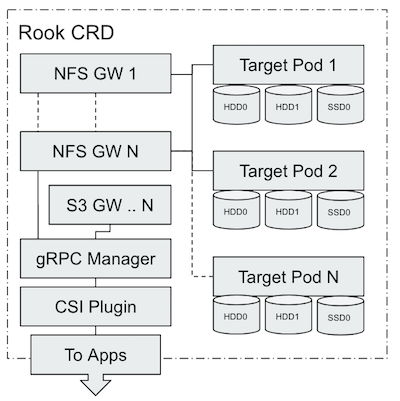

この記事は「[Rookだらけの Advent Calendar](https://qiita.com/advent-calendar/2019/rook)」 2019/12/19分です。Rook EdgeFSについて記事を投稿します。

Rookだらけの Advent Calendar 2019/12/19: Rook EdgeFS 今までの回で疑問に思ったこと調べていきます。

## TL;DR

*   まとまった情報はMediumにあります
*   一通りMediumの記事を読むと「EdgeFS完全に理解した」になります。
*   この記事では３つの記事を頑張ってサマライズしました。
*   今までやっていて気になったことを調べました。

### はじめに

ここまでやってきて、ドキュメントに沿ってやるとたしかにEdgeFSクラスタが起動してNFSが使えたり、iSCSIが使えたりという状態にすることができました。

ただ、仕組みとしてはいまいち理解が追いつかない部分があったのも事実です。仕組みを知らなくてもクラスタが構成できて各種ストレージサービスができることは大変素晴らしいのですが、エンジニアとしては納得いきません。

ということで、本日は急遽予定を変更して今まで気になってきたことを調べてみた結果をアドベントカレンダーとします。

<!--more-->

<!-- toc -->


## 情報源

なお、調べていくと公式ドキュメント類ではなく、Mediumの投稿が一番思想や仕組みがまとまっているということがわかりました。

ただし、Rook v1, v1.1のリリースで数多くの機能が実装されたり、対応が入っているため完全にすべてが正しいというわけではなさそうです。記事の投稿日が１年ほど前のものについてはその当時はそうだったぐらいで読むのがいいかと思います。

参照したのは以下の記事です。

一通り目を通していいただくとなんとなく背景が見えてくると思います。

* [Securing and Deduplicating the Edge with EdgeFS](https://medium.com/edgefs/securing-and-deduplicating-the-edge-with-edgefs-bd93e7f786de)

* [A Data Layer for Edge/IoT and Fog Computing](https://medium.com/edgefs/a-data-layer-for-edge-iot-and-fog-computing-4e04df4f761a)

* [EdgeFS cluster with Rook in Google Cloud](https://medium.com/edgefs/edgefs-cluster-with-rook-in-google-cloud-2dabe954cda6)


また、リリース時期やQAなどはSlack上で行われています。

[rook-io.slack.com](https://slack.rook.io/)

## 技術的に気になっていたこと

### GWノードとかデータノードとかあるのか？

存在してます、ポッド一覧からは見分けがつかないという状況のようです。

EdgeFSをデプロイ後にポッドを見るといくつかあります。  
target- XX podはデータおよびGWノードです。target data podとgateway pod の間に目に見える違いがないです。

gateway pod はまったく同じ構造で、同じソフトウェアを実行していますが、ディスクを提供していません。

mgr podはgRPCプロキシであり管理用のツールの提供とCSIからの通信も管理します。

```
❯ kubectl get pod -n rook-edgefs          
NAME                                    READY   STATUS  RESTARTS AGE  
rook-edgefs-mgr-795c59c456-pgdrm           3/3     Running   0 5d8h  
rook-edgefs-nfs-nfs-osaka-54b5c8f756-zkvkb 1/1     Running   2 4d23h  
rook-edgefs-nfs-nfs-tokyo-849b579fc4-k8h2d 1/1     Running   1 4d23h  
rook-edgefs-target-0                       3/3     Running   0 5d8h  
rook-edgefs-target-1                       3/3     Running   3 5d8h  
rook-edgefs-target-2                       3/3     Running   0 5d8h
```

参照した記事であったこの記事がイメージが湧きやすいです。




[https://miro.medium.com/max/440/1*PH-sN1qujkNug-N7C56jyw.png](https://miro.medium.com/max/440/1*PH-sN1qujkNug-N7C56jyw.png)


EdgeFS ではバケットという概念でデータ保管をしています。

efscli で作成したサービス(nfs-tokyo, nfs-osakaなど)のdeploymentが立ち上がり、クライアントアクセスはEdgeFSのNFSサService(kubernetesのsvc)等と通信します。

ストレージプロトコルのゲートウェイを配置することで、該当のプロトコルでデータ通信できるようなり、CCOW gateway library API がデータをPut前に暗号化ハッシュ、重複したPayloadのチャンクの除去をインラインデータでデュープで実施しています。

※ CCOW=Cloud Copy on Writeの略

チャンクのハッシュ値でEdgeFS FlexHashテーブル（後述します）に記録されます。

EdgeFSはI/O要求をターゲットグループにルーティングし、グループ内で迅速なネゴシエーションを行って、負荷の最も少ないターゲットに新しいチャンクを見つけて動的に配置します。 これにより、動的データ配置とも呼ばれるストレージデバイスの容量のバランス、利用率が向上します。

EdgeFS FlexHashテーブルはローカルサイトの構造を管理するものです。 これは自動的に検出され、ローカルサイトのサーバーメモリに存在します。efscli init でやっていることの１つはEdgeFS FlexHash テーブルを作成することです。

FlexHashはI/Oルーティングを担当し、動的負荷分散ロジックで重要な役割を果たします。 検出されたサイトトポロジに基づいて、通常形成8〜24で形成されるゾーンストレージデバイスにネゴシエーションターゲットグループを定義し、障害ドメインの適切な分散を確保します。

### どこでdedupeしているか？

この回答も上記のEdgeFSの構成がわかれば自明になります。  
CCOW gateway library API を使った時点で実施されていることになります。

### Erasure Codingっていつ有効にするの？

EdgeFS起動後にefscliでクラスタ作成時の引数で設定します。

*   ccow-ec-enabled で erasure coding を有効化
*   ccow-ec-datamode でモードを設定``$ efscli cluster create demo -o ccow-ec-enabled=1,ccow-ec-datamode=4:2:rs``

ec-datamodeについては以下の通り。

4:2:rs の意味は、

**4** data chunk   
**2** Parity  
**R**eed-**s**olomon符号でパリティを生成  
これらはすべて別の障害ドメインに分散配置されます。レプリケーションカウントは最低Parity + 1になります。

*   4:2:rs [4 chunk : 2 parity : Reed-Solomon]
*   6:2:rs [6 chunk : 2 parity : Reed-Solomon]
*   9:3:rs [9 chunk : 3 parity : Reed-Solomon]
*   2:1:xor [2 chunk : 1 parity : XOR]
*   2:2:rs [2 chunk : 2 parity : Reed-Solomon]
*   3:1:xor [3 chunk : 1 parity : XOR]
*   3:2:rs [3 chunk : 2 parity : Reed-Solomon]
*   4:1:xor [4 chunk : 1 parity : XOR]

ちなみに引数なしでクラスタを作ったときにはECは無効になってました。

### メタデータ管理

今度かきます。

### その他

*   Multi-Homed networking: 見てみたところストレージネットワークやサービス通信（アプリケーション通信）を分けることができるCNIプラグインのように見える。

## まとめ

一旦ここでEdgeFS 前半パートは終わりますが２日ほど間を開けて、S3編,CSI編,IGW編を投稿します。（テーマは適宜変更するのですべて（仮）です、CSIはやってみたいので確度は高い）

ここで [tzkoba](https://qiita.com/tzkoba) さんによる「NFS(1) Rookで構築してみる」にバトンを渡すことにします。
