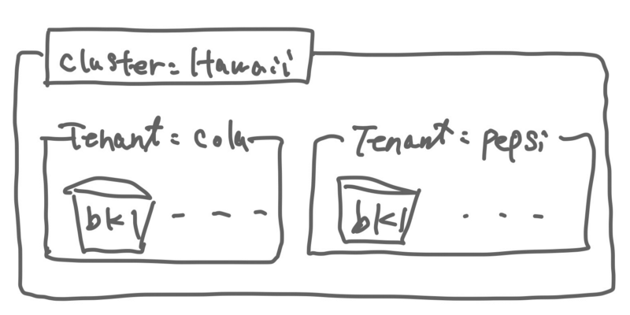
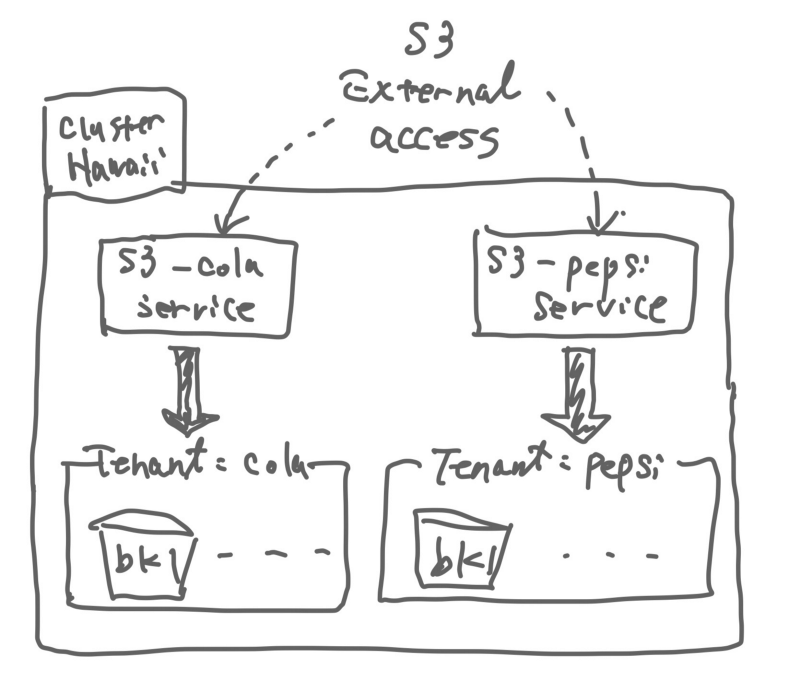
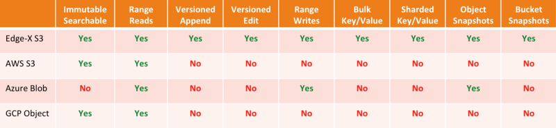

 Rookだらけの Advent Calendar 2019/12/22: Rook EdgeFS S3 S3X

この記事は「[Rookだらけの Advent Calendar](https://qiita.com/advent-calendar/2019/rook)」 2019/12/22分です。Rook EdgeFSについて記事を投稿します。

# TL;DR

*   AWSS 3/EdgeX S3 は efscli でサービス作成 →Kubernetes Object 作成ですぐ使用可能に
*   基本的にはEdgeFSの抽象化のおかげで様々なストレージプロトコルを均一的に扱える
*   AWS S3とEdge-X S3の差はオブジェクトストレージにいくつかの機能を追加しているが使い方まではドキュメントされていない（as of 2019/12/22)
*   EdgeFSでNoSQLという記載はEdge-X S3を指しているようだ### デプロイ

これまで通り相当簡単です。大きな流れとしては以下のとおりです。

1.  EdgeFS 上でefscliを使い、クラスタ作成、テナント作成、バケット作成、サービス有効化を実施
2.  Kubernetes側でCRDを作成しKubernetes上で使えるようにする

では、早速コマンドを見ていきましょう。

今回はサンプルに習って以下の構成です。

EdgeFSの構造はトップにクラスタ、クラスタ配下にテナント、テナント内にバケットという構成です。



EdgeFSの基本構成

*   Hawaii クラスタを作成
*   Cola， Pepsi テナントをHawaiiクラスタ内に作成
*   bk1 を各テナントに作成、という構造

EdgeFSでテナント作成やバケット作成、サービスの有効化をします。

```
❯ kubectl get po --all-namespaces | grep edgefs-mgr  

rook-edgefs          rook-edgefs-mgr-795c59c456-pgdrm             3/3     Running   0          7d  

❯ kubectl exec -it -n rook-edgefs rook-edgefs-mgr-795c59c456-pgdrm -- env COLUMNS=$COLUMNS LINES=$LINES TERM=linux toolbox   

Defaulting container name to rook-edgefs-mgr.  
Use &#39;kubectl describe pod/rook-edgefs-mgr-795c59c456-pgdrm -n rook-edgefs&#39; to see all of the containers in this pod.  

Welcome to EdgeFS Mgmt Toolbox.  
Hint: type neadm or efscli to begin  

root@rook-edgefs-mgr-795c59c456-pgdrm:/opt/nedge# efscli system status  
ServerID 0BB3CBC69F1727D1FDD4A3E0285863B6 worker3:rook-edgefs-target-0-0 ONLINE  
ServerID FACE8E0BBE22B723E4530FAB11F566AD worker1:rook-edgefs-target-1-0 ONLINE  
ServerID 89CC529B2CB846199F37FE6594224118 worker2:rook-edgefs-target-2-0 ONLINE  

root@rook-edgefs-mgr-795c59c456-pgdrm:/opt/nedge# efscli cluster create Hawaii  
root@rook-edgefs-mgr-795c59c456-pgdrm:/opt/nedge# efscli tenant create Hawaii/Cola  
root@rook-edgefs-mgr-795c59c456-pgdrm:/opt/nedge# efscli bucket create Hawaii/Cola/bk1  
root@rook-edgefs-mgr-795c59c456-pgdrm:/opt/nedge# efscli tenant create Hawaii/Pepsi  
root@rook-edgefs-mgr-795c59c456-pgdrm:/opt/nedge# efscli bucket create Hawaii/Pepsi/bk1`
```


ここまでで、クラスタ、テナント、バケットを作成しました。

作成したバケットを外部に公開するためサービスを作成します。この操作はEdgeFS側の操作です。

```
root@rook-edgefs-mgr-795c59c456-pgdrm:/opt/nedge# efscli service create s3 s3-cola  
root@rook-edgefs-mgr-795c59c456-pgdrm:/opt/nedge# efscli service serve s3-cola Hawaii/Cola  
Serving new tenant Hawaii/Cola  

root@rook-edgefs-mgr-795c59c456-pgdrm:/opt/nedge# efscli service create s3 s3-pepsi  
root@rook-edgefs-mgr-795c59c456-pgdrm:/opt/nedge# efscli service serve s3-pepsi Hawaii/Pepsi  
Serving new tenant Hawaii/Pepsi  

root@rook-edgefs-mgr-795c59c456-pgdrm:/opt/nedge# efscli service config s3-cola X-Domain cola.com  
X-Service-Name: s3-cola  
X-Service-Type: s3  
X-Description: S3 Object  
X-Region: -  
X-Servers: -  
X-Status: disabled  
X-Auth-Type: disabled  
X-Need-MD5: true  
X-ACL-On: false  
X-List-Max-Size: 1000  
X-List-Cache: true  
X-List-All-Buckets: true  
X-HTTP-Port: 9982  
X-HTTPS-Port: 9443  
X-HTTPS-Key: -  
X-HTTPS-Cert: -  
X-Ciphers: -  
X-Default-Tenant: -  
X-Default-Owner: -  
X-Trust-Proxy: true  
X-Access-Log: false  
X-Number-Of-Versions: 1  
X-Domain: cola.com  

root@rook-edgefs-mgr-795c59c456-pgdrm:/opt/nedge# efscli service config s3-pepsi X-Domain pepsi.co  
X-Service-Name: s3-pepsi  
X-Service-Type: s3  
X-Description: S3 Object  
X-Region: -  
X-Servers: -  
X-Status: disabled  
X-Auth-Type: disabled  
X-Need-MD5: true  
X-ACL-On: false  
X-List-Max-Size: 1000  
X-List-Cache: true  
X-List-All-Buckets: true  
X-HTTP-Port: 9982  
X-HTTPS-Port: 9443  
X-HTTPS-Key: -  
X-HTTPS-Cert: -  
X-Ciphers: -  
X-Default-Tenant: -  
X-Default-Owner: -  
X-Trust-Proxy: true  
X-Access-Log: false  
X-Number-Of-Versions: 1  
X-Domain: pepsi.co`
```

S3サービスを公開しました。ここまででEdgeFS側のオペレーションは終了です。



サービスを作成しバケットを外部に公開するイメージ図

## Kubernetes上でアクセスできるようにする

２つのサービスを公開するようにCRDを作成します。今回はやってみたの性質上最小限のマニフェストで実施します。yamlのパラメータは[https://rook.io/docs/rook/master/edgefs-s3-crd.html](https://rook.io/docs/rook/master/edgefs-s3-crd.html) を参照ください。


S3 cola テナント用CRD


S3 pepsi 用テナント


上記の名前のみを変更したCRDを使いマニフェストを適応していきます。
```
❯ kubectl create -f s3-cola.yaml  
s3.edgefs.rook.io/s3-cola created  

❯ kubectl create -f s3-pepsi.yaml  
s3.edgefs.rook.io/s3-pepsi created  

❯ kubectl get pod -n rook-edgefs  
NAME                                         READY   STATUS    RESTARTS   AGE  
rook-edgefs-mgr-795c59c456-pgdrm             3/3     Running   0          7d  
rook-edgefs-nfs-nfs-osaka-54b5c8f756-zkvkb   1/1     Running   2          6d15h  
rook-edgefs-nfs-nfs-tokyo-849b579fc4-k8h2d   1/1     Running   1          6d15h  
rook-edgefs-s3-s3-cola-5f88bfd97f-dk2zc      1/1     Running   0          25s  
rook-edgefs-s3-s3-pepsi-7bfbf6ffd7-bsbjn     1/1     Running   0          21s  
rook-edgefs-target-0                         3/3     Running   0          7d  
rook-edgefs-target-1                         3/3     Running   3          7d  
rook-edgefs-target-2                         3/3     Running   0          7d
```

ポッドが上記のCRDで指定したインスタンス分動起していることがわかりします。(以下のイメージです。）

```
rook-edgefs-s3-s3-cola-5f88bfd97f-dk2zc      1/1     Running   0          25s  
rook-edgefs-s3-s3-pepsi-7bfbf6ffd7-bsbjn     1/1     Running   0          21s
```

外部公開するためのサービス（KubernetesのService)を確認します。

```
❯ kubectl get svc -n rook-edgefs
NAME                        TYPE        CLUSTER-IP       EXTERNAL-IP   PORT(S)                                                                                                               AGE
rook-edgefs-mgr             ClusterIP   10.97.189.186    <none>        6789/TCP                                                                                                              7d
rook-edgefs-nfs-nfs-osaka   ClusterIP   10.108.69.77     <none>        49000/TCP,2049/TCP,2049/UDP,32803/TCP,32803/UDP,20048/TCP,20048/UDP,111/TCP,111/UDP,662/TCP,662/UDP,875/TCP,875/UDP   6d15h
rook-edgefs-nfs-nfs-tokyo   ClusterIP   10.99.230.182    <none>        49000/TCP,2049/TCP,2049/UDP,32803/TCP,32803/UDP,20048/TCP,20048/UDP,111/TCP,111/UDP,662/TCP,662/UDP,875/TCP,875/UDP   6d15h
rook-edgefs-restapi         ClusterIP   10.107.169.160   <none>        8881/TCP,8080/TCP,4443/TCP                                                                                            7d
rook-edgefs-s3-s3-cola      ClusterIP   10.107.177.146   <none>        49000/TCP,9982/TCP,9443/TCP                                                                                           72s
rook-edgefs-s3-s3-pepsi     ClusterIP   10.96.119.236    <none>        49000/TCP,9982/TCP,9443/TCP                                                                                           68s
rook-edgefs-target          ClusterIP   None             <none>        <none>                                                                                                                7d
rook-edgefs-ui              ClusterIP   10.108.180.155   <none>        3000/TCP,3443/TCP
```

こちらもテナントごとにサービスが作成されました。ClusterIPで作られているので外部に公開するにはNodePortかLoadBalancerに変更するかIngressを使うのがいいでしょう。今回はMetalLBを導入しているのでLoadBalancerで実施しアクセスしています。

```
rook-edgefs-s3-s3-cola      ClusterIP   10.107.177.146   <none>        49000/TCP,9982/TCP,9443/TCP                                                                                           72s
rook-edgefs-s3-s3-pepsi     ClusterIP   10.96.119.236    <none>        49000/TCP,9982/TCP,9443/TCP                                                                                           68s
```

Service.Type を LoadBalancer に変更

```
rook-edgefs-s3-s3-cola      LoadBalancer   10.107.177.146   192.168.122.11   49000:30852/TCP,9982:31066/TCP,9443:32070/TCP
```

curl でLoadBalancerの外部IP向けにアクセスし、確認しました。

```
❯ curl http://192.168.122.11:9982/ -v
*   Trying 192.168.122.11...
* TCP_NODELAY set
* Connected to 192.168.122.11 (192.168.122.11) port 9982 (#0)
> GET / HTTP/1.1
> Host: 192.168.122.11:9982
> User-Agent: curl/7.58.0
> Accept: */*
>
< HTTP/1.1 200 OK
< X-Powered-By: Express
< x-amz-id-2: cb2bb1edd5628c9b
< x-amz-request-id: 883db10ba9866c33
< Date: Sun, 22 Dec 2019 08:28:00 GMT
< Connection: keep-alive
< Transfer-Encoding: chunked
<
<?xml version="1.0"?>
* Connection #0 to host 192.168.122.11 left intact
<ListAllMyBucketsResult xmlns="http://s3.amazonaws.com/doc/2006-03-01/"><Owner><ID>Hawaii_Cola</ID><DisplayName>Hawaii_Cola</DisplayName></Owner><Buckets><Bucket><Name>bk1</Name><CreationDate>2019-12-22T08:28:00.066Z</CreationDate></Bucket></Buckets></ListAllMyBucketsResult>%
```

少し見づらいですが、HTTP 200 status code となり、テナント名、バケットが見えているのが確認できました。

## Edge-X S3 のデプロイ

EdgeFS にはオブジェクトストレージとしてもう1つEdge-X S3 というものがあります。

マニフェスト的にはAWS S3 をデプロイしたときに使ったものの `kind: S3` を `kind: S3X` と変更しただけです。

AWS S3との違いとしては以下の表がまとまっています。




[https://github.com/Nexenta/edge-dev/blob/master/images/EdgeVsS3.png?raw=true](https://github.com/Nexenta/edge-dev/blob/master/images/EdgeVsS3.png?raw=true)


APIの一覧は以下のサイトに公開されていました。

[Edge-X S3-compatible API · Apiary](https://edgex.docs.apiary.io/#)


デプロイまではRookのドキュメントに乗っているのですが、それ以降の使い方としてはMediumのブログを参照すると出てきます。例えば以下の記事でEdge-X S3が書かれています。

[Data Geo-Transparency with EdgeFS on Mac for Developers](https://medium.com/edgefs/data-geo-transparency-with-edgefs-on-mac-for-developers-58d95f8672de)


では、デプロイしていきます。今回はS3で準備したクラスタ、テナント、バケットを共有する形とします。色々見ているとどうやらEdgeFSの中のバケット１つにたいして様々なストレージプロトコルが割り当てられることがわかりました。
```
root@rook-edgefs-mgr-795c59c456-pgdrm:~# efscli service create s3x s3x-cola  
root@rook-edgefs-mgr-795c59c456-pgdrm:~# efscli service serve s3x-cola Hawaii/Cola  
Serving new tenant Hawaii/Cola  
root@rook-edgefs-mgr-795c59c456-pgdrm:~# efscli service create s3x s3x-pepsi  
root@rook-edgefs-mgr-795c59c456-pgdrm:~# efscli service serve s3x-pepsi Hawaii/Pepsi  
Serving new tenant Hawaii/Pepsi  
root@rook-edgefs-mgr-795c59c456-pgdrm:~# efscli service list  
nfs-osaka  
nfs-tokyo  
s3-cola  
s3-pepsi  
s3x-cola  
s3x-pepsi  
root@rook-edgefs-mgr-795c59c456-pgdrm:~#`
```
Kubernetesへ戻り、以下２つのマニフェストを作成し適応します。

* s3x-cola.yaml

```yaml
apiVersion: edgefs.rook.io/v1
kind: S3X
metadata:
  name: s3x-cola
  namespace: rook-edgefs
spec:
  instances: 1
```


* s3x-pepsi.yaml

```yaml

apiVersion: edgefs.rook.io/v1
kind: S3X
metadata:
  name: s3x-pepsi
  namespace: rook-edgefs
spec:
  instances: 1
```


上記マニフェストを適応すると以下のような状態になります。Edge-X S3 の場合はAWS S3 と比べProxyコンテナが付与された形で立ち上がります。

```
❯ kubectl get pod  
NAME                                         READY   STATUS    RESTARTS   AGE  
prometheus-rook-prometheus-0                 3/3     Running   4          123m  
rook-edgefs-mgr-795c59c456-pgdrm             3/3     Running   4          7d6h  
rook-edgefs-nfs-nfs-osaka-54b5c8f756-zkvkb   1/1     Running   4          6d21h  
rook-edgefs-nfs-nfs-tokyo-849b579fc4-k8h2d   1/1     Running   2          6d21h  
rook-edgefs-s3-s3-cola-5f88bfd97f-dk2zc      1/1     Running   1          6h42m  
rook-edgefs-s3-s3-pepsi-7bfbf6ffd7-bsbjn     1/1     Running   1          6h42m  
rook-edgefs-s3x-s3x-cola-68b69db694-fdlxp    2/2     Running   0          89s  
rook-edgefs-s3x-s3x-pepsi-69c6d466d4-4cnc8   2/2     Running   0          86s  
rook-edgefs-target-0                         3/3     Running   4          7d6h  
rook-edgefs-target-1                         3/3     Running   7          7d6h  
rook-edgefs-target-2                         3/3     Running   3          7d6h
```

中身を見てみます。Proxyが立ち上がっているのがわかります。

```
❯ kubectl describe pod rook-edgefs-s3x-s3x-cola-68b69db694-fdlxp
Name:           rook-edgefs-s3x-s3x-cola-68b69db694-fdlxp
Namespace:      rook-edgefs
Priority:       0
Node:           worker2/192.168.122.217
Start Time:     Sun, 22 Dec 2019 00:52:45 +0900
Labels:         app=rook-edgefs-s3x
                edgefs_svcname=s3x-cola
                edgefs_svctype=s3x
                pod-template-hash=68b69db694
                rook_cluster=rook-edgefs
Annotations:    <none>
Status:         Running
IP:             10.244.1.21
Controlled By:  ReplicaSet/rook-edgefs-s3x-s3x-cola-68b69db694
Containers:
  rook-edgefs-s3x-s3x-cola:
    Container ID:  docker://cc96bbe29ea92c02510f46325ae0898ff654ddf054c91b29742a0218841f2cf4
    Image:         edgefs/edgefs:latest
    Image ID:      docker-pullable://edgefs/edgefs@sha256:65c0390e929e530ea9a5f2a57ae3ef4be938df0d786afc8a20e358d9b1335564
    Ports:         49000/TCP, 4000/TCP, 4443/TCP
    Host Ports:    0/TCP, 0/TCP, 0/TCP
    Args:
      s3x
    State:          Running
      Started:      Sun, 22 Dec 2019 00:52:49 +0900
    Ready:          True
    Restart Count:  0
    Environment:
      CCOW_LOG_LEVEL:     5
      CCOW_SVCNAME:       s3x-cola
      HOST_HOSTNAME:       (v1:spec.nodeName)
      K8S_NAMESPACE:      rook-edgefs (v1:metadata.namespace)
      EFSS3X_HTTP_PORT:   4000
      EFSS3X_HTTPS_PORT:  4443
    Mounts:
      /opt/nedge/etc.target from edgefs-datadir (rw,path=".etc")
      /opt/nedge/var/run from edgefs-datadir (rw,path=".state")
      /var/run/secrets/kubernetes.io/serviceaccount from rook-edgefs-cluster-token-tgfz8 (ro)
  s3-proxy:
    Container ID:  docker://1c9a5ac5d9723ca7064cba563eace0b002f1f46a87b27801d5384064c975ac3d
    Image:         edgefs/edgefs-restapi:latest
    Image ID:      docker-pullable://edgefs/edgefs-restapi@sha256:6ae7bdaa662171a1e6859303aa713f62f2858919b59c95a234e131d8f1e855a8
    Port:          9982/TCP
    Host Port:     0/TCP
    Args:
      s3
    State:          Running
      Started:      Sun, 22 Dec 2019 00:52:52 +0900
    Ready:          True
    Restart Count:  0
    Environment:
      CCOW_LOG_LEVEL:  5
      CCOW_SVCNAME:    s3x-cola
      DEBUG:           alert,error,info
      HOST_HOSTNAME:    (v1:spec.nodeName)
      K8S_NAMESPACE:   rook-edgefs (v1:metadata.namespace)
      GW_PORT:         9982
      GW_PORT_SSL:     9443
    Mounts:
      /opt/nedge/etc.target from edgefs-datadir (rw,path=".etc")
      /opt/nedge/var/run from edgefs-datadir (rw,path=".state")
      /var/run/secrets/kubernetes.io/serviceaccount from rook-edgefs-cluster-token-tgfz8 (ro)
Conditions:
  Type              Status
  Initialized       True 
  Ready             True 
  ContainersReady   True 
  PodScheduled      True 
Volumes:
  edgefs-datadir:
    Type:          HostPath (bare host directory volume)
    Path:          /var/lib/edgefs
    HostPathType:  
  rook-edgefs-cluster-token-tgfz8:
    Type:        Secret (a volume populated by a Secret)
    SecretName:  rook-edgefs-cluster-token-tgfz8
    Optional:    false
QoS Class:       BestEffort
Node-Selectors:  rook-edgefs=cluster
Tolerations:     node.kubernetes.io/not-ready:NoExecute for 300s
                 node.kubernetes.io/unreachable:NoExecute for 300s
Events:
  Type    Reason     Age   From               Message
  ----    ------     ----  ----               -------
  Normal  Scheduled  105s  default-scheduler  Successfully assigned rook-edgefs/rook-edgefs-s3x-s3x-cola-68b69db694-fdlxp to worker2
  Normal  Pulling    104s  kubelet, worker2   Pulling image "edgefs/edgefs:latest"
  Normal  Pulled     101s  kubelet, worker2   Successfully pulled image "edgefs/edgefs:latest"
  Normal  Created    101s  kubelet, worker2   Created container rook-edgefs-s3x-s3x-cola
  Normal  Started    101s  kubelet, worker2   Started container rook-edgefs-s3x-s3x-cola
  Normal  Pulling    101s  kubelet, worker2   Pulling image "edgefs/edgefs-restapi:latest"
  Normal  Pulled     98s   kubelet, worker2   Successfully pulled image "edgefs/edgefs-restapi:latest"
  Normal  Created    98s   kubelet, worker2   Created container s3-proxy
  Normal  Started    98s   kubelet, worker2   Started container s3-proxy
```

## Edge-X S3 オペレーションを試す

AWS S3 との差異の部分について実施します。

EdgeX-S3のポイントを確認します。External IPを割り当ててます。

```
NAME                        TYPE           CLUSTER-IP       EXTERNAL-IP      PORT(S)                                                                                                               AGE  
rook-edgefs-s3x-s3x-cola    LoadBalancer   10.105.230.5     192.168.122.12   49000:30163/TCP,4000:31779/TCP,4443:31545/TCP                                                                         23h`
```


ここからは以下の通りデータをjsonに追加して、NoSQLライクに取得できるところを確認しようとしましたがうまく行きませんでした。（もう少し調査して追記できたらします。）リクエストを投げると以下のエラーとなってしまいました。

```
# create JSON Key-Value database mydb.json in bucket bk1
$ curl -X POST -H "Content-Type: application/json" \
    --data '{"key1":"value1"}' \
    "http://192.168.122.12:4000/bk1/mydb.json?comp=kv&finalize"
 
$ curl "http://192.168.122.12:4000/bk1/mydb.json?comp=kv&key=key1&maxresults=3&values=1"
```

エラー内容(Podのログ）がセグっているのでもしかしたらMasterブランチを使っているのが理由かもしれません。

```
rook-edgefs-s3x-s3x-cola-68b69db694-fdlxp rook-edgefs-s3x-s3x-cola 2019-12-22T15:28:52.348Z cmd.Wait() failed with 'signal: segmentation fault (core dumped)'
```

## まとめ

今回はS3・Edge-X S3を試してみました。今まで通りefscliでクラスタ、テナント、バケットを作成し、サービスを有効にすることでストレージが使えるようになるというEdgeFS自体の抽象化されたオペレーションはなれると素晴らしくわかりやすいと思うようにもなりました。

そこからCRDでKubernetesへ見せるための手順も最小限で始めるのは非常に簡単です。

もちろん、運用を見越した設定をするためには十分な設計が必要になるとも感じています。

この記事を確認当たって大体のEdgeFSのアーキテクチャがわかってきましたやはり手を動かしながら学ぶということは大事ですね。

明日はEdgeFS CSI(NFS)を記事にしていきます。
