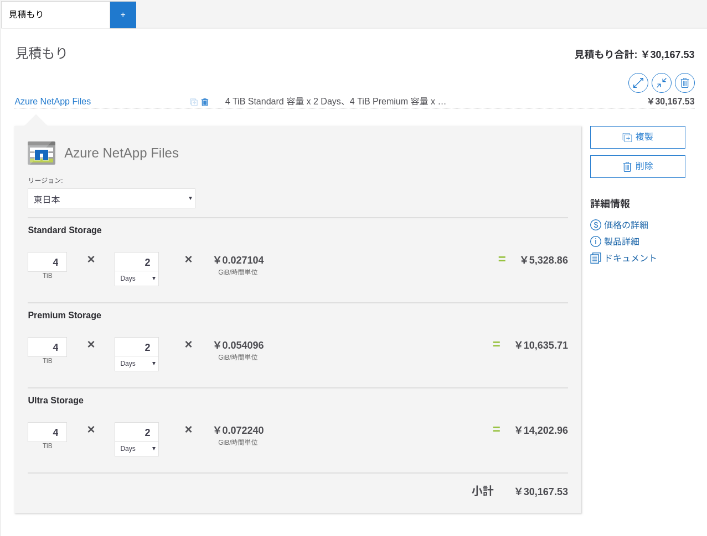

[Kubernetes Meetup #27](https://k8sjp.connpass.com/event/162343/) にブログ枠で参加してきました。

遅れて参戦。見れなかったところはYoutubeで確認しました。
当日のメインはこちらのYoutubeで公開されています。

<iframe width="560" height="315" src="https://www.youtube-nocookie.com/embed/0ZKUMWkjlck" frameborder="0" allow="accelerometer; autoplay; encrypted-media; gyroscope; picture-in-picture" allowfullscreen></iframe>

当日の様子はtogetter でまとめられています。

https://togetter.com/li/1462391

# session1: Amazon EKSによるスケーラブルなCTR予測システムを導入した話 (30min)

スライドはこちらに公開されています。

<iframe src="//www.slideshare.net/slideshow/embed_code/key/3c0YkPZPV5s00s" width="595" height="485" frameborder="0" marginwidth="0" marginheight="0" scrolling="no" style="border:1px solid #CCC; border-width:1px; margin-bottom:5px; max-width: 100%;" allowfullscreen> </iframe> 
 <strong> <a href="//www.slideshare.net/ToshiyaYoshida3/amazon-eksctr" title="Amazon EKSによるスケーラブルなCTR予測システム" target="_blank">Amazon EKSによるスケーラブルなCTR予測システム</a> </strong> from <strong><a href="https://www.slideshare.net/ToshiyaYoshida3" target="_blank">駿哉 吉田</a></strong> 

機械学習をKubernetesで実施したり、本番運用で工夫した点を話されていました。
推論部分のアーキテクチャについて詳しく説明されていたので、このあたりが工夫されたことと感じました。
Kubernetes Joｂではなく、Kube-batch等の検討したかも知りたかったです。

また、Kubernetesを使うことでスケール部分に関しても解決できる

SQS を使ったケースだと失敗した場合とかにSQSに残しておけばいずれかは実行されることになると思うので、
こういう使い方もあるんだという知見を得ました。

今回のスライドでは推論結果をS3に保存するところまでだったので、
その後どうやってアプリケーションからつくかが気になりました。

## CTR予測とは？

ユーザ情報と広告配信ログなどを元に広告クリック率を予測

CTR予測をする理由：クリック課金型の場合、クリックのしやすさを広告の配信を適切に実施

## 学習で使ったツール

* LightBGM
* Spark (EMR

## プロジェクト始動の経緯 

通信キャリアの日次は一括送信

* CTR予測を日次バッチ処理で行いたい。

## 課題

満たすべき要求

* CTR予測はは１時間で実施
* 対象は10+-3億レコード処理を１時間以内に完了させる必要がある

しかし、

* EC2１台で試算したところ10時間
* 将来的に予測単位を増加する可能性がある

→ スケーラブルな構成にする必要がある

## 達成すること

- 10億レコードを1時間で予測（推論？）

## Why Kubernetes

以下の機械学習システム特有の問題を解決できる。

### 1. 再現性の課題

フレームワークのバージョン際、環境などで学習精度が異なる

### 2. 継続的な学習・デプロイが必要

特徴量の分布等は日々変化するため、モデルも追従

### 3. 学習と推論でライフサイクルと要求リソースが異なる

* 学習は週次 、推論は日次
* 学習はシングル、推論はマルチインスタンス
* 学習（GPU）, 推論（CPU） の使い分け

上記３つをKubernetesで解決

途中でまとめられていましたが以下の文言が本当にそのままなのだなと思いました。

> Kubernetesが、 エンジニアリングの煩わしい部分を解決し、 データサイエンティストが Modelingの本質的な部分に注⼒することができる

* コンテナによる再現性の担保
* 学習・デプロイ観点での拡張性と将来性
* 異なるライフサイクル、要求リソースにあわせてリソース最適化
   
## 実装について

今回は学習と推論は同じアーキテクチャなので推論の方を説明。

### 環境について

* イメージビルドはCircle CI
* AWS サービスは Terraform を使用
* k8s Deloyment等はhelmを使って実施

### 推論処理のフローについて

1. 特徴量データをS3に配置ー＞SQSへ
1. SQSにメッセージが貯まると推論Podがスケールし始める (SQS Podscaler)
1. Pending Podを検知してノードのスケールアップ
1. Cluster Autoscalerを使ってScaleup（out？）
1. 各Podが特徴量データをダウンロードし、推論結果をS3へアップロード

聞いているとなるほどと思う構成でした。
Pod Pendingでノード数を増やすということができることに目からウロコ。

## コンポーネント

### NodeGroup

ライフサイクル、要求リソースが異なる単位で分けている

### Kubernetes Job の検討

結果不採用。

理由
- クラスタ外からJobキックの必要あり
    - Job 実行のためのJobが必要
- Parallelism が想定より柔軟ではなかった
    - Podごとにパラメータを経校したり、リソースを変更できない
        - パーティションのパラメータを変更できなkった
        - 1000並列だと1000YAML必要になる
   
採用: Kubernetes Deploy

* Kubernetes Deployment で実施
* pub/sub でJobのキックが受動的になる
* スケーリングは負荷ベースで自律的に行うことができる

### Autoscaler

前述しましたがこの構成は負荷や状況に応じて自律的にスケールするところがポイントと捉えました。
その中核を担うコンポーネントとして以下の２つを紹介されていました。

* [Pod AutoScaler](https://github.com/sideshowbandana/k8s-sqs-autoscaler)
    * AWS SQS のキューのサイズで自動的にポッドをオートスケールしてくれる (replicas を増やしてくれる)
* [Cluster Autoscaler](https://github.com/kubernetes/autoscaler/tree/master/cluster-autoscaler/cloudprovider/aws)
    * AWS の AutoScaling Group を操作するもの（正しいでしょうか…）
  
### Config Injection

コンテナ外で設定ファイルを管理する。

* 設定ファイルの一元化
* 異なる環境に設定を挿入できる
* 学習パラメータ変更のたびにコンテナをビルドする必要がなくなった

こちらは普通のConfigMapのことなのかな？

## モデル管理

以下の２つの方法があり。
それぞれメリットデメリットがあるが今回はシンプルな外部ストレージを選択

- コンテナに含み、コンテナとして管理する
    - Good: ソースコードと紐付けて管理することができる
    - Good: Rolling update でモデル更新可能 
    - Bad: 再学習のたびにコンテナのビルドからデプロイをする必要がある
- 外部ストレージで管理する
    - Good: 再学習に伴うコンテナのビルド〜デプロイ作業は不要
    - Good: シンプルなシステム構成
    - Bad: ソースコードと紐付けた管理ができない。

TLを見ていてもいくつか意見が別れるところでもありました。

# Session2: Azure Kubernetes Serviceで実現する超低予算＆(ほぼ)フルマネージド＆本格的なWordPress環境 (30min)

スライドはこちらで公開されています。
このセッションについてはスライドにコメント等詳細に記載があるので補足やその場で言っていたことをメモしていきたいと思います。

ブログにも書かれています、https://tech-lab.sios.jp/archives/18794 

チャレンジしたかったので、Kubernetesでやる。チャレンジいいですね。

Kubernetes移行後の構成はこちらです。

* MySQLはインターナルサーバ
* フロントとバックエンドでノードで分けるNGINX INGRESSで割り振り
* フロントは静的ファイルを返すので格安VMを使っている、振り分けはノードラベルで実施

## LoadBalancer 周り

外部公開時のIngressコントローラーの箇所でも、その当時はAzureのXXがなかったや、現在はできている等の話もあり非常に知識が飛び交うところもありました。
今回のセッションの構成を作成した時点では ingress-nginx controllerを使用。(Application gateway ingress がプレビューだったため)

Application Gateway Ingressは現時点（2020/1/29時点）で提供されているとの情報も得られました。

https://azure.github.io/application-gateway-kubernetes-ingress/

 

## Pod 生成周り

* WORDPRESS標準イメージだとPluginを上書きしてしまっている？
* ローリングアップデート Apache SIGTERMを送るとリクエストを落としてしまう（まじで）

WPは環境変数がたくさん…
パスワードはSecretで管理（Secretリソースは同管理しているのか？）

聞いていて、いいなと思ったのが、マニフェストがすごく丁寧に作られている感じがしました。
聞いているとここはこうできるのでは？と思うところもしっかり説明されており、試行錯誤の形跡が見れました。

## データベース周り

データベースはAzure Database for MySQLを使っているとのこと。

## ストレージ周り

Kubernetesストレージのところでは会場に潜んでいたKubernetesストレージ勢からいくつかコメントがあったのと皆さん疑問に思うことについてもQAされていたのでここに記載しておきます。

ここに引用しておきます。

<blockquote class="twitter-tweet">
VMでNFS。データプロテクションをどうしたんだろう？NFSはRAIDでもなんでもないので、VM(or SSD/HDD)が飛んだら...<a href="https://twitter.com/hashtag/k8sjp?src=hash&amp;ref_src=twsrc%5Etfw">#k8sjp</a>
&mdash; ysakashita (@ysakashita3) <a href="https://twitter.com/ysakashita3/status/1222481491176771584?ref_src=twsrc%5Etfw">January 29, 2020</a></blockquote> 

<blockquote class="twitter-tweet">
NFS、SPOFになってない？？ <a href="https://twitter.com/hashtag/k8sjp?src=hash&amp;ref_src=twsrc%5Etfw">#k8sjp</a>
&mdash; こば（右）- Koba as a DB engineer (@tzkb) <a href="https://twitter.com/tzkb/status/1222481489687760899?ref_src=twsrc%5Etfw">January 29, 2020</a></blockquote> 

聞いていておそらく問題箇所がわかったのでここで共有しておきます。

###  Azure Files が遅い

どのディスクまでは触れていなかったように見えましたが、容量が小さかったのでIOPSの制限に抵触したというのが遅い原因だと考えられます。
SMBに対してLinuxからSamba経由でつなぐ場合、メタデータの取得等でIOPSを使用してしまいます。
解決方法としては容量増やすPremiumストレージにする等が考えられます。

### Azure  NetApp  Files 速いけど、高い

こちらについても少なからず知見があるので記載しておきます。

高速なのは間違いないです。ただし、サービスの形態として大きなQuotaを購入(４TB）ミニマム、
その中でVolumeを作成し、容量を切り出します。Volumeを作成した容量に対してIOPS/スループットが設定されます。

４TB2日で４万とのことでしたが、Azure の Calculator で計算してみると以下の通りです。どういうやり方だと4TB/２日になるかは逆算できませんでした。

一番高いサービスレベルで２日で約15000円です。
一番低いサービスレベルで２日で約5400円です。

そこそこ良いお値段ですが、性能がでてバックアップ・クローンなどのデータ管理が優れているという前提であればそんなに高くないのではと感じました。
今回のお題のWordPressでは確かにオーバースペックなのは否定できません。

## まとめ・所感

TL上では俺だったらこうするという議論がなされていて、シンプルな構成をKubernetes化するということは非常にわかりやすくて挑戦したいと思う人が増えたのでは無いでしょうか。
セキュリテイ、ネットワーク、ストレージ、マニフェストに関する書き方などがTL上で議論されておりセッションだけでなくTLも面白かったなと思います。

## LT x 4

LTについては１つ５分ということもあり、それぞれ印象に残ったことを書いていこうと思います。
それと立ち見だったのでメモを取れていない…。

### Leader Election in Kubernetes 

個人的にあまり知らない領域だったので黙って聞いてました。
etcd をみていい感じにやっているのかと思ってました。

### CloudRunが(ちょっと)素敵過ぎる件

CloudRun -> App Engine -> GKE  の順番で考える、GKEを使うのは最終手段的な立ち位置。
マネージドにまかせて楽しくやりましょう。

<iframe src="//www.slideshare.net/slideshow/embed_code/key/GTJNnkNZQe7ZGL" width="595" height="485" frameborder="0" marginwidth="0" marginheight="0" scrolling="no" style="border:1px solid #CCC; border-width:1px; margin-bottom:5px; max-width: 100%;" allowfullscreen> </iframe> 
 <strong> <a href="//www.slideshare.net/ssuserf50296/cloudrun" title="CloudRunが(ちょっと)素敵過ぎる件" target="_blank">CloudRunが(ちょっと)素敵過ぎる件</a> </strong> from <strong><a href="https://www.slideshare.net/ssuserf50296" target="_blank">Takuya Tezuka</a></strong> 

### chaos-meshによりDisk/IOをサチってモニタリング

AKS のディスクIOがサチったはなし、それに伴うオブザーバビリティ重要というはなし。
このようなテストをするために[Chaos Mesh](https://github.com/pingcap/chaos-mesh)というものがある。
これを聞いてChaos Mesh試してみようと思いました。

### 今から始めるMicroService開発(Kind + IPv6)

このあたりで退出してしまったので覚えている部分だけ…

* Ninja
* NWがち勢
* Kind
* IPv6をわかっていない（すいませんすいませんすいません。）

### Kubernetesを利用したエッジクラスタロボティクス分散システムの構築

スライドはこちら。

<iframe src="//www.slideshare.net/slideshow/embed_code/key/181DX4LdWJostk" width="595" height="485" frameborder="0" marginwidth="0" marginheight="0" scrolling="no" style="border:1px solid #CCC; border-width:1px; margin-bottom:5px; max-width: 100%;" allowfullscreen> </iframe> 
 <strong> <a href="//www.slideshare.net/FujitaTomoya/kuberenetes-robotics-distributed-system" title="Kuberenetes Robotics Distributed System" target="_blank">Kuberenetes Robotics Distributed System</a> </strong> from <strong><a href="https://www.slideshare.net/FujitaTomoya" target="_blank">Tomoya Fujita</a></strong> 

こちらは完全に聞けなかったのですが、TLの反応を見るに5分だと足りないような内容だったと推測しました。

スライドを見ると以下のような構成になっていと見て取れました。

- Edge コンピューティングにKubernetesを採用
    - arm64 & x86 kubernetes cluster!?
- Edgeとクラウドをフェデレーションさせている！？

個人的にフェデレーションについては試行錯誤したことがあるのでどのようにエッジとクラウドをフェデレーションさせているかが非常にきになりました。
