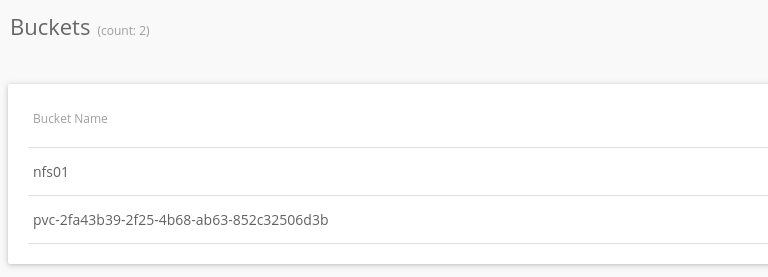

## Rookだらけの Advent Calendar 2019/12/23: Rook EdgeFS CSIを試す（CSIって聞くとホッとする）

この記事は「[Rookだらけの Advent Calendar](https://qiita.com/advent-calendar/2019/rook)」 2019/12/23分です。Rook EdgeFSについて記事を投稿します。

## TL;DR

*  著者はCSIと聞くと安心する
*  EdgeFS CSI は NFS/iSCSI が存在
*  （おそらく）Dynamic ProvisioningはCSI NFS/iSCSIを使うEdgeFS には NFS, iSCSI がありますが、CSIモードのNFS, CSI もあります。

こちらがリポジトリのようですが、まだコミット数も少ない状態です。

[Nexenta/edgefs-csi](https://github.com/Nexenta/edgefs-csi)


Edge FSのNFS、iSCSIと何が違うのかについては歴史的な背景がありそうですが、はっきりとしたことはわかりません。やってみたところDynamic Provisioning したい場合はCSI版を使うことになりそうですし、これから始めるのであればCSIを実装しているドライバを使うほうがいいのではないかと思います。

CSI(Container Storage Interface)について知りたい場合はぜひこちらを。

[Rook v1.0で読み解くCSI - Qiita](https://qiita.com/tzkoba/items/a3d6a73898c341fb6fe1)

[KubernetesにおけるContainer Storage Interface (CSI)の概要と検証 - Qiita](https://qiita.com/ysakashita/items/4b56c2577f67f1b141e5)

[As of 2019/4 Kubernetes CSI について](https://medium.com/makotows-blog/as-of-april-2019-kubernetes-csi-875afa9feac)


EdgeFS NFSについてはこちらを。

[Rook: EdgeFS NFSサービスをデプロイする](https://medium.com/makotows-blog/rook-edgefs-nfs-service-65365863aa7e)


## 事前準備

バージョンによってはCSIのCRDが入っていない可能性があるので確認し、なければ導入します。
```
kubectl get customresourcedefinition.apiextensions.k8s.io/csidrivers.csi.storage.k8s.io  
kubectl get customresourcedefinition.apiextensions.k8s.io/csinodeinfos.csi.storage.k8s.io
```

上記コマンドでなにも出力されなかった場合は以下のコマンドでCSIのCRDを導入しておきます。

```
kubectl create -f [https://raw.githubusercontent.com/kubernetes/csi-api/release-1.13/pkg/crd/manifests/csidriver.yaml](https://raw.githubusercontent.com/kubernetes/csi-api/release-1.13/pkg/crd/manifests/csidriver.yaml)  
kubectl create -f [https://raw.githubusercontent.com/kubernetes/csi-api/release-1.13/pkg/crd/manifests/csinodeinfo.yaml](https://raw.githubusercontent.com/kubernetes/csi-api/release-1.13/pkg/crd/manifests/csinodeinfo.yaml)
```

NFS, iSCSI をノードから使うため、ノード側にもパッケージが必要です

### for NFS  

```
apt install -y nfs-common rpcbind  
```

### for ISCSI  

```
apt install -y open-iscsi
```

## CSI NFS のデプロイ

これまでと同様に最初にクラスタ、テナント、バケットをEdgeFSで作成後、サービス公開をしてからKubernetes上でのCSI ドライバのデプロイとなります。

今回はCSI用に以下の環境をEdgeFSで作成しました。

* luster名: csi-test
* Tenant名: tenant01

edgefs-nfs-csi-driver-config.yaml というコンフィグファイルがあります、これを使ってsecretを作成します。

edgefs-nfs-csi-driver-config.yaml はCluster名、Tenant名を指定する箇所があるので準備したものを設定します。

rook 以下で以下のように作業ディレクトリへ移動します。

```
cd cluster/examples/kubernetes/edgefs/csi/nfs
```

edgefs-nfs-csi-driver-config.yaml の該当箇所を変更します。

```
# edgefs-nfs-csi-driver config file to create k8s secret
#
# $ kubectl create secret generic edgefs-nfs-csi-driver-config --from-file=./edgefs-nfs-csi-driver-config.yaml
#

#Edgefs k8s cluster options
k8sEdgefsNamespaces: ["rook-edgefs"] # element 0 is a default edgefs cluster namespace, add more when needed
k8sEdgefsMgmtPrefix: rook-edgefs-mgr # edgefs cluster management prefix

#Edgefs csi operatins options
cluster: csi-test <- ここ
tenant: tenant01  <- ここ
#serviceFilter: "nfs01" #List of comma delimeted allowed service names to filter

# Edgefs connnection options
username: admin #edgefs k8s cluster grpc connection username
password: admin #edgefs k8s cluster  grpc connection password
```

secret として上記内容を登録します。

```
kubectl create secret generic edgefs-nfs-csi-driver-config --from-file=./edgefs-nfs-csi-driver-config.yaml
```

次にCSI ドライバを作成します。

```
$ kubectl apply -f edgefs-nfs-csi-driver.yaml 

csidriver.csi.storage.k8s.io/io.edgefs.csi.nfs created 
serviceaccount/edgefs-nfs-csi-controller-service-account created 
clusterrole.rbac.authorization.k8s.io/edgefs-nfs-csi-controller-cluster-role created 
clusterrolebinding.rbac.authorization.k8s.io/edgefs-nfs-csi-controller-cluster-role-binding created 
service/edgefs-nfs-csi-controller created 
statefulset.apps/edgefs-nfs-csi-controller created 
serviceaccount/edgefs-nfs-csi-node-service-account created 
clusterrole.rbac.authorization.k8s.io/edgefs-nfs-csi-node-cluster-role created 
clusterrolebinding.rbac.authorization.k8s.io/edgefs-nfs-csi-node-cluster-role-binding created 
daemonset.apps/edgefs-nfs-csi-node created
```

CSI のポッドが上がってきました。

```
❯ kubectl get pod   
NAME                                  READY   STATUS    RESTARTS   AGE  
edgefs-nfs-csi-controller-0           3/3     Running   0          23h  
edgefs-nfs-csi-node-4mnrz             2/2     Running   0          23h  
edgefs-nfs-csi-node-hktzt             2/2     Running   0          23h  
edgefs-nfs-csi-node-xvlx5             2/2     Running   0          23h`
```

ここまで来るともう安心です。

## StorageClassの作成、PVCをバインド

StorageClassの作成からPVCバウンドまでを一気に実施します。

今回はexamplesにStorageClassからまるっと作ってくれるものが入っているのでそれを使います。

```
$ cd rook/cluster/examples/kubernetes/edgefs/csi/nfs/examples
$ kubectl apply -f dynamic-nginx.yaml
```

サンプルだと様々なパラメータが設定してありますが、上述した`edgefs-nfs-csi-driver-config.yaml` に記載済みのため省略しました。
```
❯ kubectl get pvc -n rook-edgefs  
NAME                 STATUS   VOLUME                                     CAPACITY   ACCESS MODES   STORAGECLASS                  AGE  
edgefs-nfs-csi-pvc   Bound    pvc-2fa43b39-2f25-4b68-ab63-852c32506d3b   1Gi        RWO            edgefs-nfs-csi-storageclass   23h
```

しっかりとBoundされました。nginx pod も立ち上がっています。

```
❯ kubectl get pod -n rook-edgefs  
NAME                                         READY   STATUS    RESTARTS   AGE  
nginx                                        1/1     Running   0          23h
```

中身としては以下の通りです。

```yaml
apiVersion: storage.k8s.io/v1  
kind: StorageClass  
metadata:  
  name: edgefs-nfs-csi-storageclass  
provisioner: io.edgefs.csi.nfs  
parameters:  
  segment: rook-edgefs  
  service: nfs-csi  
  cluster: csi-test  
  tenant: tenant01
```

上記StorageClassを使ったPVCの例

```yaml
apiVersion: v1  
kind: PersistentVolumeClaim  
metadata:  
  name: edgefs-nfs-csi-pvc  
spec:  
  accessModes:  
  - ReadWriteOnce  
  resources:  
    requests:  
      storage: 1Gi  
  storageClassName: edgefs-nfs-csi-storageclass
```

EdgeFS 側では以下のようにバケットが作成されていました。



PVC バウンド後に自動でEdgeFSのバケットが作成されている。(pvc-2fa… という名前のものです。)

## まとめ

EdgeFS のNFS/iSCSIとCSI NFS/iSCSIはどう使い分けるのか？ということは感じますが基本路線はCSIを使うほうがこれからはいいと考えています。

今回もとりあえず動かすところをやってみました。はじめの一歩としてはこんなにすぐ正常に動くというところは素晴らしいと感じました。

またこの記事では記載しませんでしたが、CSIということでSnapshotやCloneにも対応しています。
