Rookだらけの Advent Calendar 2019/12/24: EdgeFSの真髄

この記事は「[Rookだらけの Advent Calendar](https://qiita.com/advent-calendar/2019/rook)」 2019/12/24分です。Rook EdgeFSについて記事を投稿します。

この記事では本来であればISGWでデータレプリケーションできたというのを確認したかったのですがデータが送信されていることは確認できたのですが、送信先で受信したデータを見ることができず、一部 未完の状態です。続きは原因解析後に再度別の記事として記載したいと思います。

記事は本家サイトを翻訳している部分があります。

## TL;DR

* EdgeFS の地理的に透過的やグローバルネームスペースという機能はISGWを使って実現
* 非同期レプリケーションでデータ同期は実現
* PoC Friendly ではない…

## EdgeFS Inter-Segment Gatewayの概要

本日紹介する **EdgeFS Inter-Segment Gateway link(ISGW)** がEdgeFSをクロスサイト、クロスクラウドグローバルネームスペースを実現するレプリケーション機能となります。

何をしているかというと、ファイル、オブジェクト、ブロックをどこにあってもアクセスできるように変更分データチャンクをなるべくシームレスに非同期レプリケーションするものです。

ファイル、ブロックは1つ以上のEdgeFSで管理されているオブジェクトから成り立っています。**究極には全てはオブジェクトであり**、グローバルで変更不可かつ自己検証されています。

EdgeFSの技術を使うことで利用者は簡単にグローバルネームスペースを管理のオーバヘッドなしで作成することができます。ISGWのセットアップが終わると、変更がリンクされているところに拡散されます。最終的には接続されているすべてのサイトがファイルの変更ブロックのみを受け取ることができます。

本家の画像を借りると以下のようなイメージです。

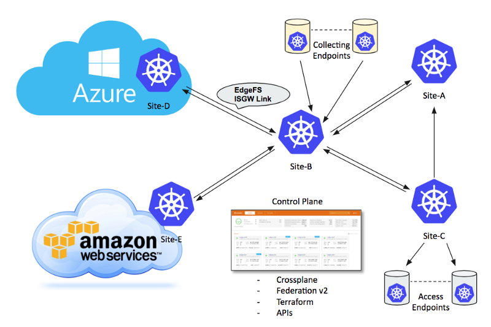

[https://rook.io/docs/rook/master/media/edgefs-isgw.png](https://rook.io/docs/rook/master/media/edgefs-isgw.png)

ISGW link は転送すべきデータを削減するだけでなく、重複排除も実施しています。仕組みとしてはグローバルでユニークな暗号シグネチャを使うことでデータ転送をしなくてもいいようしています。その結果、グローバルネームスペースでの重複排除を実現しています。

グローバルネームスペースを実現する方法としてはデータをレプリケーションし、すべてのサイトで一貫性を保った状態にするという方法を取っているようです。サイトのすべてのデータではなく、管理者がレプリケーションすると行ったバケット単位でのレプリケーションになります。膨大な量になった場合に運用面が課題になりそうです。

後ほどUIでも確認しますが、ISGWは複数のモードをサポートします。

* EdgeFS間双方向
* EdgeFS間単方向(送信、受信）
* EdgeFS -ファイル

EdgeFSメタデータもグローバルに不変で一意であるため、メタデータの変更のみを転送するモードを有効にすることができます。このモードを有効にすると、ユーザーはオンデマンドで変更をフェッチできる効率的なアクセスエンドポイントを構築できます。その結果、組み込みのE-LRUエビクションポリシー（キャッシュからデータを待避させること）を使用して、グローバルおよび地理的に分散したキャッシュフォグ集約が作成されます。

## EdgeFS UI から試してみる

EdgeFS cliからテナント、ISGWの設定を実施後、CRDを作成して試すこともできるのですが今回はより簡易的にWebUIから実施する手順で試します。

環境としては設定できるかどうかを試すため、1つのKubernetesクラスタ上に２つのEdgeFSクラスタを作成しレプリケーションをしてみます。

Clusterを２つ作成します。

* Hawaii
* Hawaii-r (-r でremoteという意味でつけます）

Hawaiiにバケットを１つ作成し、NFSサービスを付与します。ここでNFSサービスを付与する理由は純粋に転送データのインジェスト用です。

Hawaiiクラスタのbk1がHawaii-rクラスタにレプリケーションされれば成功です。

大きな流れとしては以下の通りです。最小限のレプリケーションを試すため単方向の同期としました。

1. レプリケーション先のISGW(hawaii-r)を先に作成し、IPを付与した状態にします。
2. レプリケーション元のIGSWを作成（hawaii)
3. データをNFS経由でインジェストし様子を見ます

### ISGW サービスの作成

ここからはISGWを作成する手順を見ていきます。

1. EdgeFS の Services画面から「Add Service」をクリックします。

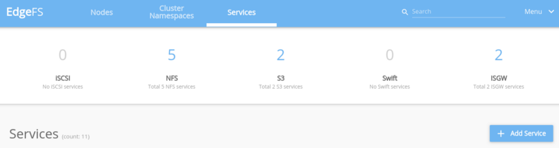

2. ISGWサービスを作成します。Name,Service Type を選択し「Add」をクリック。

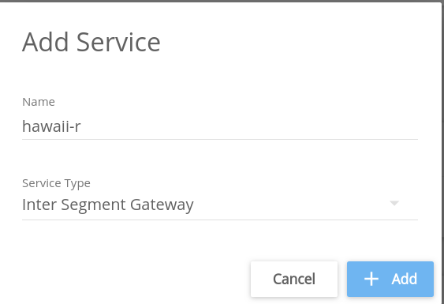


### 受信側のEdgeFSクラスタ作成

3. レプリケーションの送信先を選択する画面になるため、「EdgeFS」を選択。

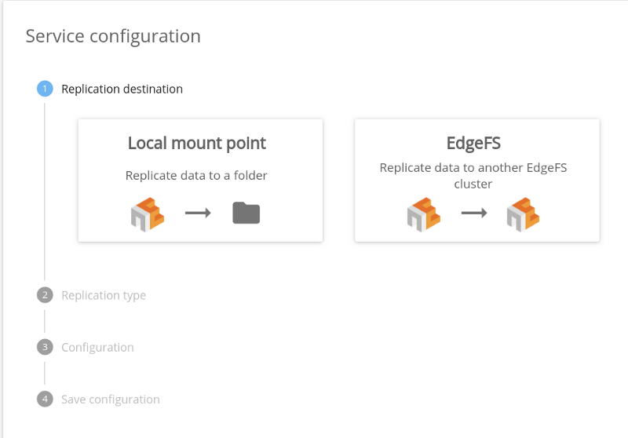


4.「Inter-Segment Endpoint」を選択。


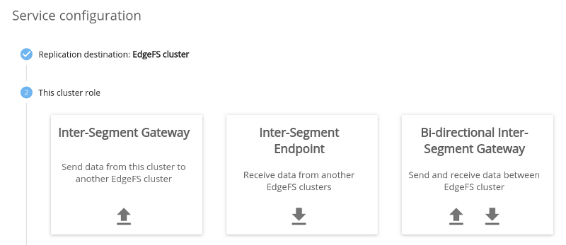

5. Auth key を設定

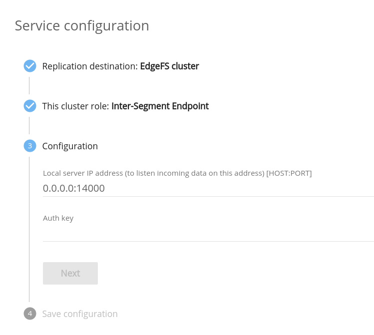

6. ApplyをクリックするとISGWサービスが作成されます。

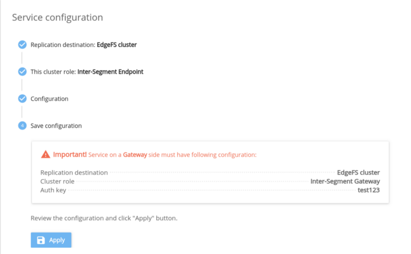

7. Disabled -&gt; Enableに変更します。

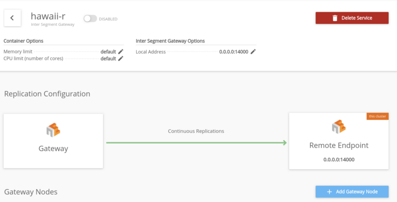


この時点でKubernetesのSVCが作成され、エンドポイントのIPが付与されます。

### 送信側のEdgeFSクラスタ作成

次に送信側（hawaii) を作成します。

1.  同様にサービスを作成します。

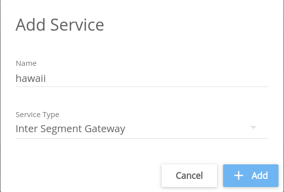

2. EdgeFS を選択します。

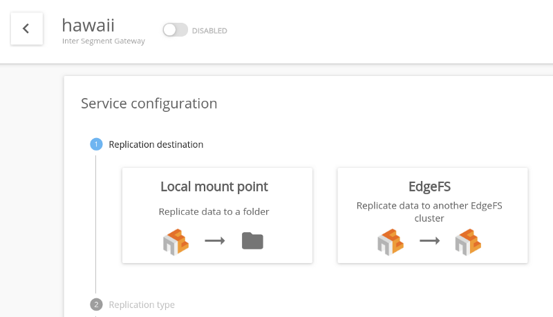

3. 「Inter-Segment Gateway」 を選択

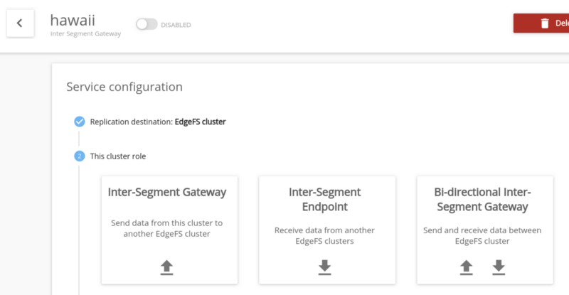

4. Replication typeをInitial and continuousで設定

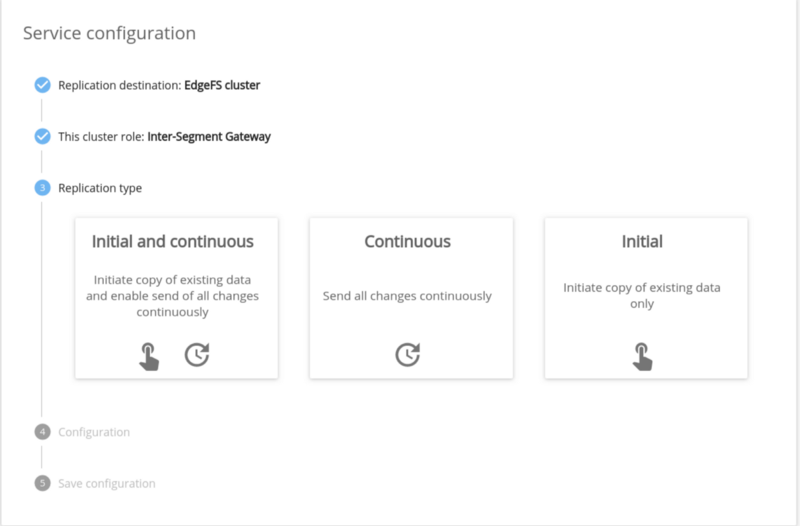

```
❯ kubectl get svc -n rook-edgefs | grep hawaii  
rook-edgefs-isgw-hawaii-r      ClusterIP   10.100.194.238   none 49000/TCP,14000/TCP    4m32s
```

上記のように事前にKubernetes側でSVCのIPを確認しておきます。

5. 確認したIPを以下の画面で入力。

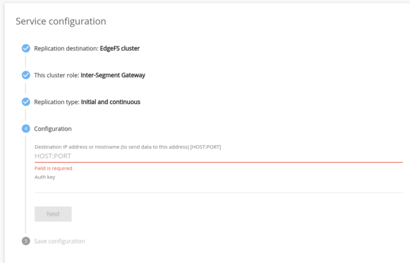

6. 確認画面になるので「Apply」後、サービスをenableに変更します。

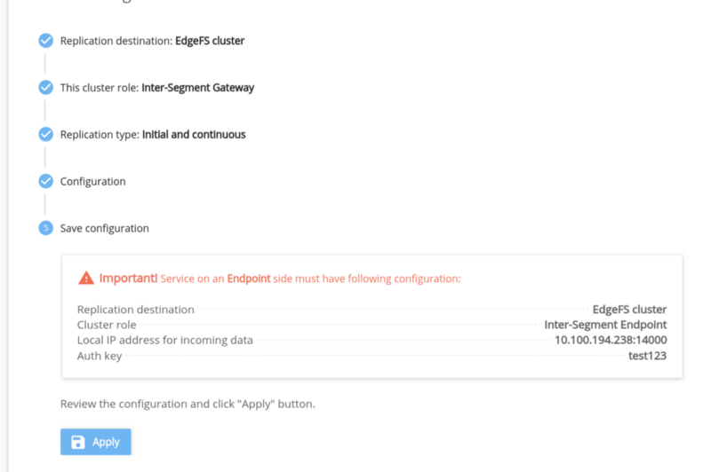

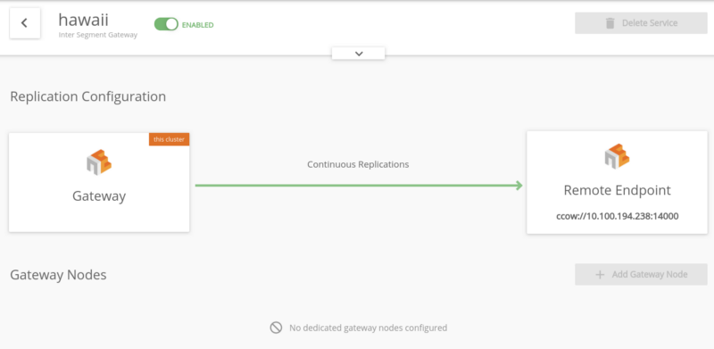


最後にレプリケーションするバケットを選択します。（下図は追加後のもの）

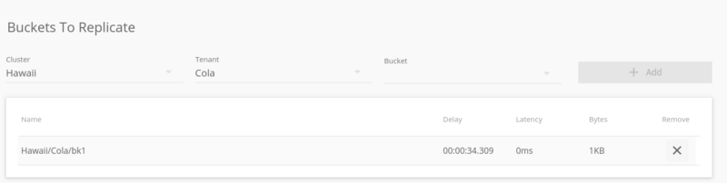

ここまででレプリケーション設定が完了しました。

## レプリケーションの状況を確認する

レプリケーションの状況はedgefs-mgrポッドから確認できます。
```
$ kubectl exec -it -n rook-edgefs rook-edgefs-mgr-795c59c456-pgdrm -- env COLUMNS=$COLUMNS LINES=$LINES TERM=linux toolbox  
```

上記のコマンドを実行すると、toolboxにログインします。送信元のhawaiiクラスタの状態を確認すると以下の通りとなります。出力結果真ん中以降の「bytes sent」の箇所に変化があります。

```
Defaulting container name to rook-edgefs-mgr.
Use 'kubectl describe pod/rook-edgefs-mgr-795c59c456-pgdrm -n rook-edgefs' to see all of the containers in this pod.
Welcome to EdgeFS Mgmt Toolbox.
Hint: type neadm or efscli to begin
root@rook-edgefs-mgr-795c59c456-pgdrm:/opt/nedge# efscli service show hawaii -s
X-Service-Name: hawaii
X-Service-Type: isgw
X-Service-Worker: isgwserv
X-Servers: -
X-Auth-Type: disabled
X-Description: Inter Segment Gateway
X-ISGW-Local: -
X-ISGW-DFLocal: -
X-ISGW-Encrypted-Tunnel: -
X-Container-Network: -
X-ISGW-Basic-Auth: dGVzdDEyMzp0ZXN0MTIz
X-ISGW-Remote: ccow://10.100.194.238:14000
X-ISGW-Role: 1
X-ISGW-Direction: 1
X-ISGW-Replication: 3
X-ISGW-Force: 1
X-ISGW-MDOnly: 0
X-ContainerIPv6-0BB3CBC69F1727D1FDD4A3E0285863B6: -
X-Container-Hostname-0BB3CBC69F1727D1FDD4A3E0285863B6: worker3
X-ContainerId-0BB3CBC69F1727D1FDD4A3E0285863B6: rook-edgefs-isgw-hawaii-674658fd7b-gkdzh
X-Status: enabled
[
  Hawaii/Cola/bk1
]
Stats for Hawaii/Cola/bk1:
PARAMETER          |      VALUE        
+----------------------------+------------------+
  Timestamp                  | 20 seconds ago    
  Status                     | idle              
  State                      | continuous        
  Mode                       | complete          
  Processing delay           | 30s               
  Latency                    | 0ms               
  Requests                   | 12                
  Version manifests          | 0                 
  Chunk manifests            | 0                 
  Data chunks sent           | 0                 
  Data chunks received       | 0                 
  Snapviews                  | 0                 
  Bytes sent                 | 1.5K              
  Bytes received             | 0                 
  Send throughput per sec    | 0                 
  Receive throughput per sec | 0                 
  Network errors             | 14                
  Local io errors            | 0                 
  Remote io errors           | 0
root@rook-edgefs-mgr-795c59c456-pgdrm:/opt/nedge#
```

送信元のバケットにデータをつくり、しばらくしてから再度同じコマンドを実行すると以下のようになります

```
root@rook-edgefs-mgr-795c59c456-pgdrm:/opt/nedge# efscli service show hawaii -s
X-Service-Name: hawaii
X-Service-Type: isgw
X-Service-Worker: isgwserv
X-Servers: -
X-Auth-Type: disabled
X-Description: Inter Segment Gateway
X-ISGW-Local: -
X-ISGW-DFLocal: -
X-ISGW-Encrypted-Tunnel: -
X-Container-Network: -
X-ISGW-Basic-Auth: dGVzdDEyMzp0ZXN0MTIz
X-ISGW-Remote: ccow://10.100.194.238:14000
X-ISGW-Role: 1
X-ISGW-Direction: 1
X-ISGW-Replication: 3
X-ISGW-Force: 1
X-ISGW-MDOnly: 0
X-ContainerIPv6-0BB3CBC69F1727D1FDD4A3E0285863B6: -
X-Container-Hostname-0BB3CBC69F1727D1FDD4A3E0285863B6: worker3
X-ContainerId-0BB3CBC69F1727D1FDD4A3E0285863B6: rook-edgefs-isgw-hawaii-674658fd7b-gkdzh
X-Status: enabled
[
  Hawaii/Cola/bk1
]
Stats for Hawaii/Cola/bk1:
PARAMETER          |      VALUE        
+----------------------------+------------------+
  Timestamp                  | 13 seconds ago    
  Status                     | idle              
  State                      | continuous        
  Mode                       | complete          
  Processing delay           | 30s               
  Latency                    | 0ms               
  Requests                   | 18                
  Version manifests          | 0                 
  Chunk manifests            | 0                 
  Data chunks sent           | 0                 
  Data chunks received       | 0                 
  Snapviews                  | 0                 
  Bytes sent                 | 2.2K              
  Bytes received             | 0                 
  Send throughput per sec    | 0                 
  Receive throughput per sec | 0                 
  Network errors             | 14                
  Local io errors            | 0                 
  Remote io errors           | 0
```
データを変更すると送信されるようになっています。

## データの確認

ここまで行くとうまく行っているように見えるのですが、実際にレプリケーションされたデータを確認しようとするとうまく行きません。

期待値としては、転送元：Hawaii/Cola/bk1, 転送先: Hawaii-r/Coala/bk1 という２つのバケットを作成し、Hawaii側にデータを書き込むと、Hawaii-rのバケットに転送されることを想定してました。インジェストと確認のため両クラスタのバケットに対してNFSサービスを割り当てウォッチしていましたが、転送先へは一向にファイルが現れませんでした。

そもそもISGWからバケットへどうデータが流れていくかの理解が追いついていないため確認方法の問題かもしれません。ここに関しては番外編で追加検証・追記を行いたいと思います。

## TODO

* Kubernetesクラスタを分けてやってみる
* 該当部分のソースを読む

## まとめ

Rook EdgeFS回を全7回でお届けしました。

一部分うまく行っていない箇所については番外編で追記をしようと思います。初めてEdgeFSを触ったのですがKubernetesとインテグレートすることによりここまで簡単にユニファイドストレージサービスを実現できるものと感動しました。本番運用を考える上ではハードウェアのデザインから考えるところは多いかと思いますがこの先が楽しみです。
